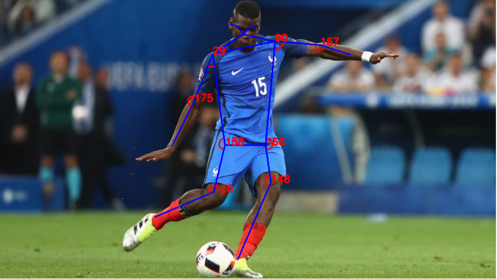

# Human-Pose-Estimation-with-MoveNet

### Setup
1. Install Python 3.7.9
2. pip install -r requirements.txt

### Repository contains files for human pose inference from pre-trained MoveNet.Lightning(FP16 quantized) Model
1. Model predicts 17 human body joints referred as keypoints with their confidence scores.
2. Predicted keypoints are displayed with connected edges on the input image and angles are computed at 8 important joints. Relevant methods are implemented in utils.py.
3. While running the flask application on webpage (through app.py), we can obtain the pose either for individual captured images from webcam or for the continuous video stream.
4. Angles are printed on the terminal with the corresponding joint names if the confidence score is above the pre-defined 'score_threshold' in utils.py file.
